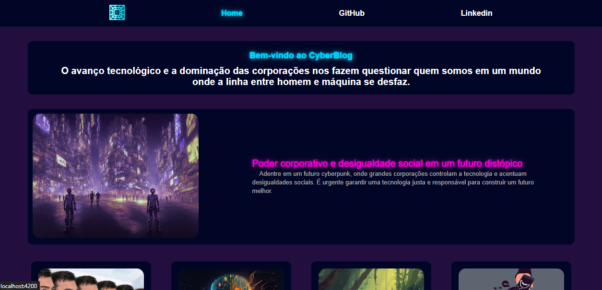
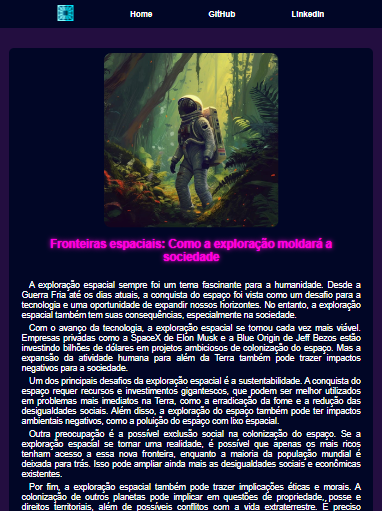

# CyberBlog
Este é um projeto simples de blog desenvolvido em Angular para o bootcamp Potência Tech Angular Developer - Powered by iFood da DIO. O tema do blog é um futuro cyberpunk, com a tecnologia impactando nocivamente esse futuro.

This project was generated with [Angular CLI](https://github.com/angular/angular-cli) version 15.2.4.

## Funcionalidades
O blog possui duas páginas:
* Home
* Content
<p>A Home com menu de navegação, os posts e um footer. O content exibe o texto do post selecionado.</p>

## Screenshots
Abaixo estão alguns screenshots:

### Home
<p align="center">

</p>

### Content
<p align="center">

</p>

## Como executar o projeto
<ol>
    <li>Clone este repositório em sua máquina local</li>
    <li>Instale as dependências utilizando o comando ``` npm install ```</li>
    <li>Inicie o servidor local com o comando ```ng serve```</li>
    <li>Acesse o projeto em seu navegador, através da URL ```http://localhost:4200```</li>
</ol>

## Tecnologias utilizadas


[](https://developer.mozilla.org/pt-BR/docs/Web/HTML)
[](https://developer.mozilla.org/pt-BR/docs/Web/CSS)

<p align="center">Copyright © DavidWillian</p>
